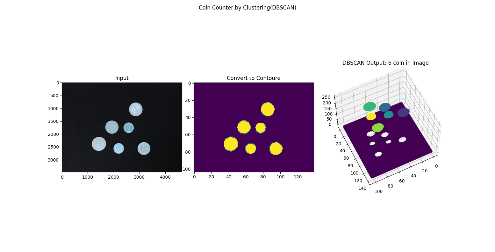
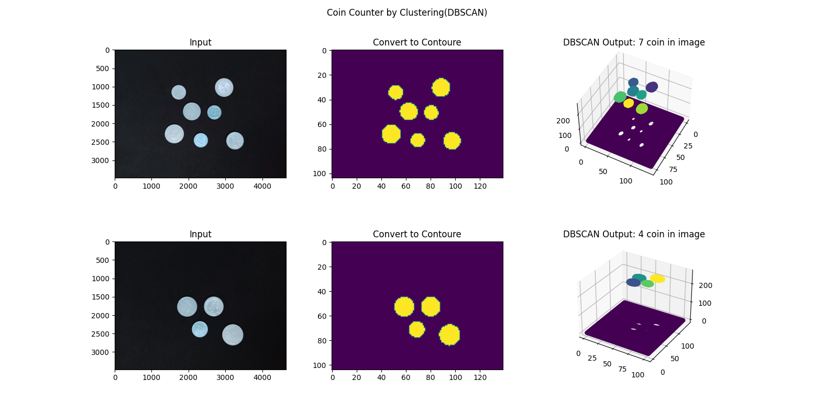
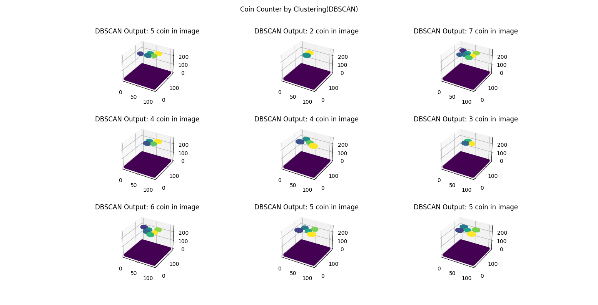

# Simple_coin_counting_by_clustering:
I will be doing a clustering on images. Images are also same as datapoints in regular ML and can considered as similar issue.
Similarity may mean to be similar looking images or may be similar size or may be similar pixel distribution, similar background etc. For different use cases, we have to derive specific image vector. ie, The image vector containing the entity of an image(contains cat or dog) will be different to an image vector having pixel distributions.

## My Projet:
* DATA : My dataset consists of 9 images with a black background, in each image I have placed some coins. I have prepared this small dataset myself.

* CODE : First point; To use this code, the background of your images must be black and matte. if there is a background with another color, you may need to change the method to remove the background.
Ok lets start it:
STEP_1 : load image and resize it to lower size
STEP_2 : convert image, BGR to GRAY , then contoure it means remove background (background pixel values to be 0)
STEP_3 : Creating a array as input data to the model that includes the indices of each pixel and their values. 
Our array should be in the dimensions of the total number of pixels of the image in 3.(rowindex,colindex,pixelvalue)
STEP_4 : fit array  on model and get the labels from model to find number of coins or clusters;for this work
i do LEN SET labels -1 (-1 means background cluster).

### Some Figures:
 

                                

                                   
