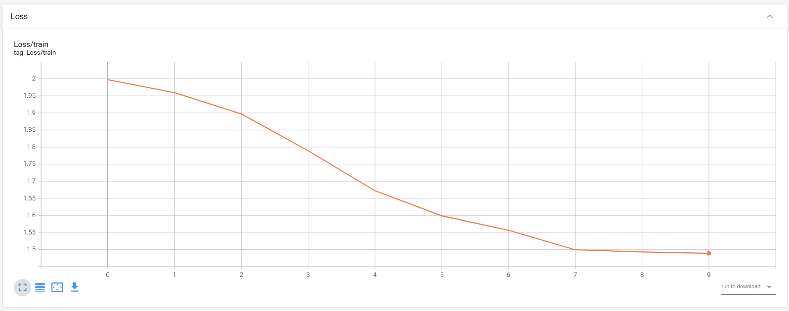
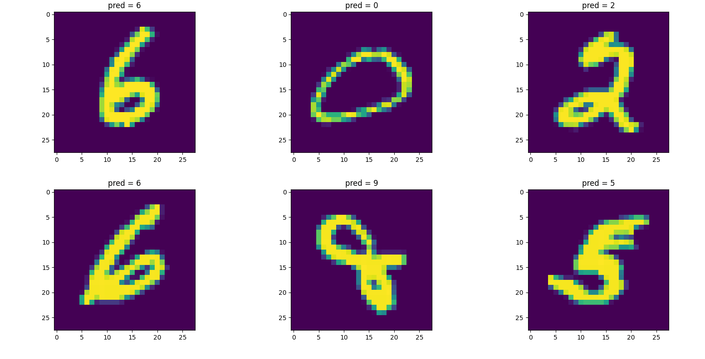
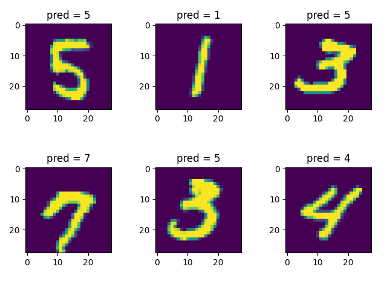

# Persian_Digit_Handwriting_Detection

## Dateset:
I work on MNIST dataset. MNIST is a large dataset of english digit handwriting images. This data consist of handwriting of different people in different fonts.

## Code:
1- We have CNN model in model.py file that model can be tion based on your task.

2- Run "cnn_mnist_cuda" script to train CNN model and save the model, and also save the some logs like loss in each itreation.

```shell
python cnn_mnist_cuda.py
```

2.1- Run "inference" to predict (test) and visualize some images.

```shell
python inference.py
```


### Some images
loss diagram in each itreation
 

outputs





