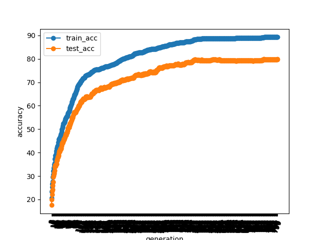
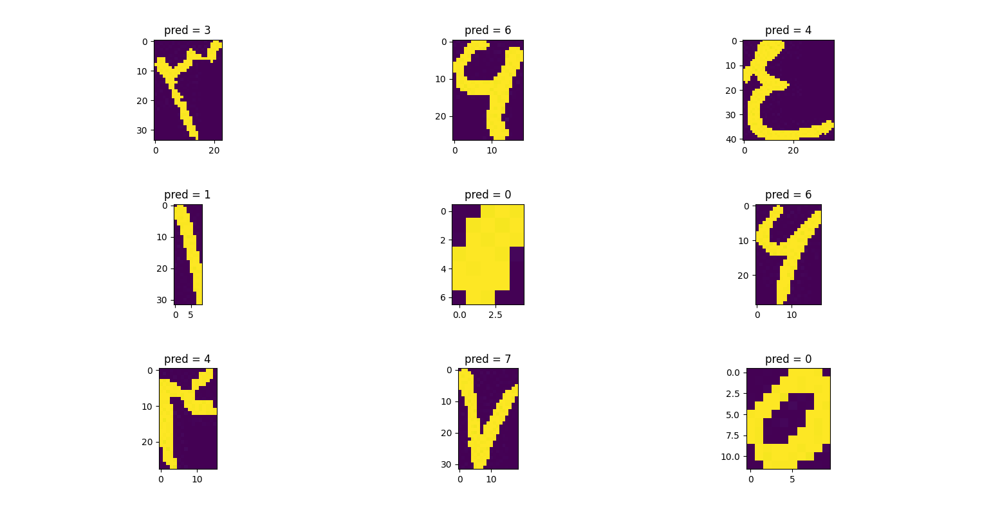
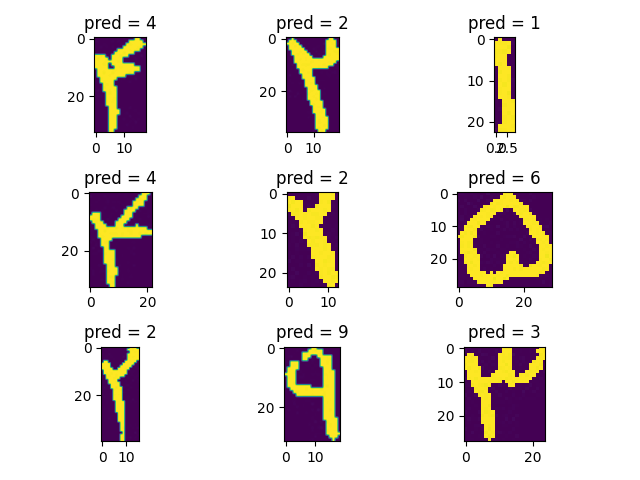
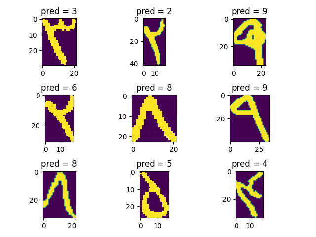
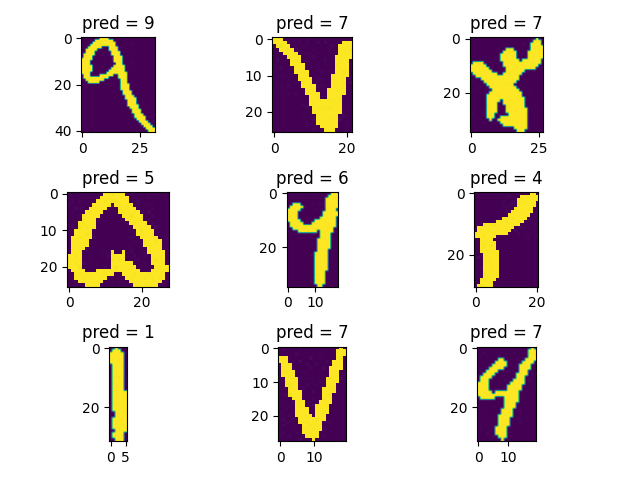

# Persian_Digit_Handwriting_Detection

## Dateset:
i work on HODA dataset. Hoda is large dataset of persian digit handwriting images . this data cinsist of handwriting of different people and different fonts.

## Code:
1- Run "read_hoda_dataset" script to preparation from "cdb" files to "npz"  and aslo set suitable siza for its images.

2.1- Run "hoda_model" to train and save the model called "finall_winner_model" in "Hoda_dataset/best_model" directory and also calculate accuracy.

2.2- "hoda_model" code is a single perceptron , for  each generation in train step  i calculated  mean loss of  each model on all data and save the best model and fot next itreation  i generated new model arond best model in last generation.  used the softmax loss function, and finally i got accuracy arond 80% and more.by the way you can use of my model in best model folder.

### Some images
train and test accuracy diagram
 

outputs

